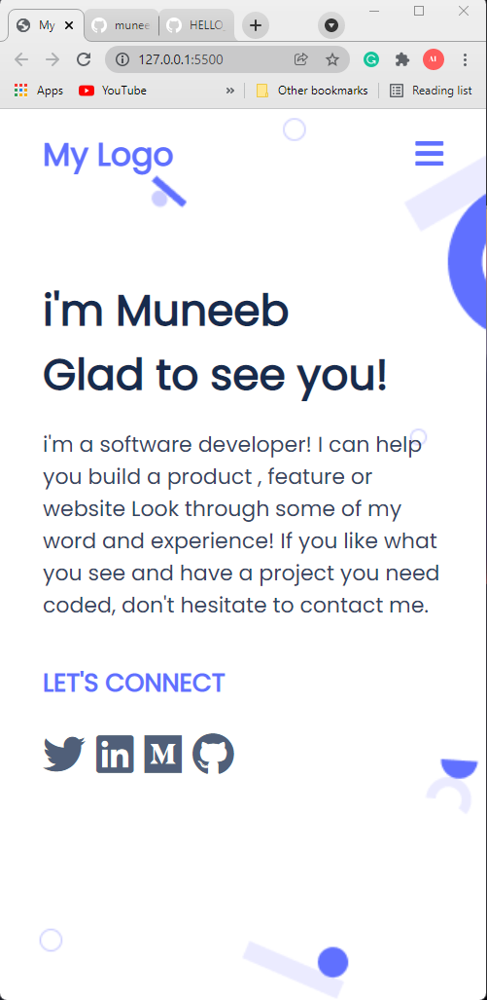
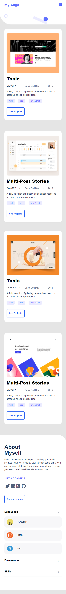
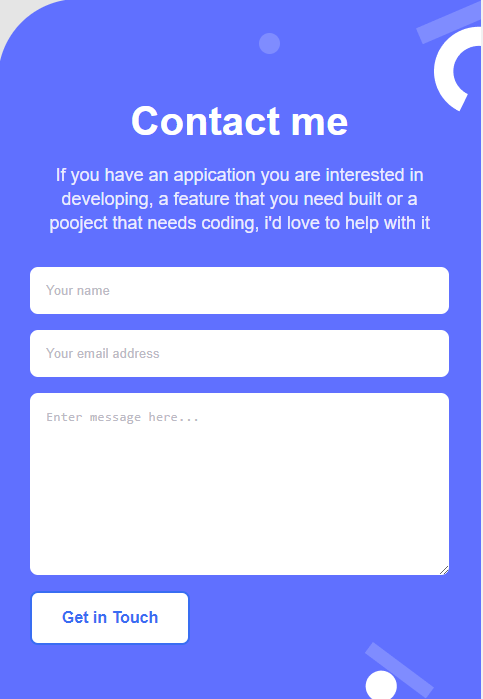
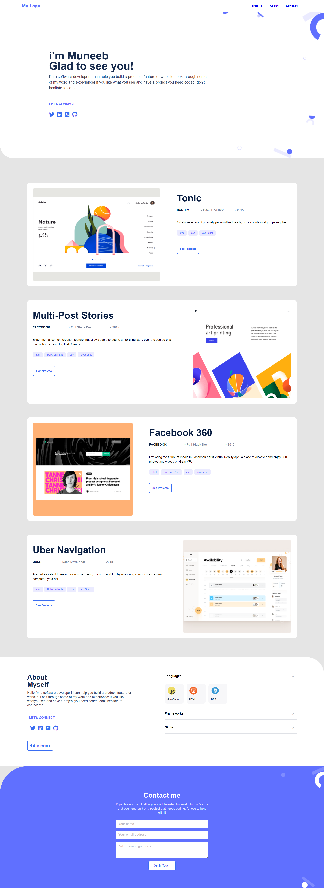

# Portfolio Project

>Live demo
https://muneebulrehman.github.io/Portfolio-Project/

# Some screenshots of development phase.

Additional description about the project and its features.
- Added Work section with multiple projects.
- Added a About Myself section.
- Added a contact me section with form.
- Made the web app desktop compatible
- Added the dropdown navbar menu.
- Added form validation using js.

# Getting Started

To get a local copy up and running follow these simple steps.
- You can clone this repo by typing <pre><code>git clone git@github.com/muneebulrehman/Portfolio-Project.git</code></pre> on your terminal.
- Type <pre><code>cd Portfolio-Project</code></pre> to access the project on the terminal

## Built With

- Major languages
- HTML and CSS
-Fontawesome icons used.

## Getting Started

To get a local copy up and running follow these simple example steps.

### Prerequisites
Browser. Any modern browser should do the job.

### Setup
Just download or clone the repo and run the index.html file.

## Authors

👤 **Muneeb Ul Rehman**

- GitHub: [@githubhandle](https://github.com/muneebulrehman)

## Contributions
👤 **Benjamin Semah**

- GitHub: [@githubhandle](https://github.com/BenjaminSemah)

👤 **Semla Belhadj**
- GitHub: [@githubhandle](https://github.com/selma-belhadj)

## 🤝 Contributing

Contributions, issues, and feature requests are welcome!

## Show your support

Give a ⭐️ if you like this project!
